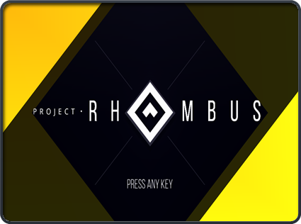
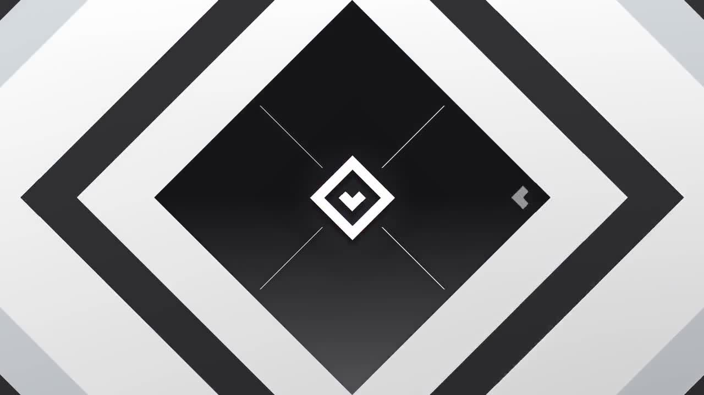
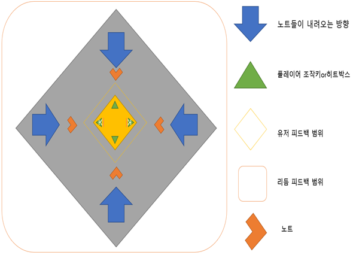
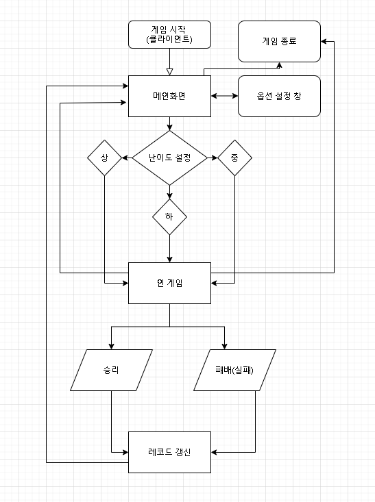

# 게임명 : 리듬뿜뿜  
  

# [목차]

[1. 컨셉](#컨셉)  
[2. 관련 이미지 and 동영상](#관련-이미지)  
[3. 대표 이미지](#대표-이미지)  
[4. 컨셉 and 대표이미지 기반 작품묘사](#대표-이미지)  
[5. "리듬 뿜뿜" 구성 요소](#리듬-뿜뿜-구성-요소)  
[6. 게임시스템디자인](#게임시스템디자인)
* [게임 오브젝트 분해](#게임-오브젝트-분해)  
* [파라미터 뽑아 보기](#파라미터-뽑아-보기)  
* [행동 뽑아 보기](#행동-뽑아-보기)  
* [상태 뽑아 보기](#상태-뽑아-보기)  
* [플레이어 캐릭터 속성](#플레이어-캐릭터-속성)  
* [게임의 규칙](#게임의-규칙)  
* [게임에서 사용될 공식](#게임에서-사용될-공식) 

[7. 개발 요구사항 & 흐름도](#개발-요구사항과-흐름도)  
* [시간별 흐름도](#시간별-흐름도)
* [키보드 이벤트에 대한 흐름도](#키보드-이벤트에-대한-흐름도)
* [용어정리](#용어정리)
[8. 개발작업 일정(6주)](#개발작업-일정(6주))

# [컨셉] 
## **_메인 컨셉_**
### [순발력]

* 초 단위로 상하좌우에서 쏟아지는 노트를 보며 플레이어는 방향을 맞춰야 함

* 노란색 노트는 처음 보인 방향에서 내려옴

* 파란색 노트는 내려오는 방향의 **180도 회전함**
	* ex (플레이어의 히트 박스 도착 직전 위에서 내려오던 노트가 아래로 감)

* 게임이 끝날 때까지 집중과 긴장감이 요구됨
  

## _서브 컨셉 1_
### [속도감]

* 처음에는 적은 양에 노트가 내려오며 시간이 흘러감에 따라 **노트에 양이 많아짐**

* 음악의 속도에 따라 내려오는 양이 많아지며 **노트의 속도가 불규칙해짐**

* 난이도별 음악의 속도 점은 비슷하게 구현
  

## _서브 컨셉 2_
### [단순함]  

* WASD 혹은 방향키만을 이용한 조작법

* **플레이어는 노트가 오는 방향에 맞춰 히트 박스를 컨트롤하면 됨**

* 진입장벽이 낮은 게임
  

## _서브 컨셉 3_
### [난이도]  

* 하 / 중 / 상으로 나뉨
	* 하는 튜토리얼로 게임의 조작법과 사용법을 익힘
	* 중은 튜토리얼보다 많은 양에 노트가 떨어지며 중간중간에 트랩 노트가 생성됨
	* 상은 빠른 전개로 쉴 새 없이 노트가 떨어짐
  

## _서브 컨셉 4_
### [즉각적인 피드백]  

* 노트를 맞출 때마다 시각적, 청각적 요소를 추가하여 플레이어에게 피드백을 줌

* 리듬 게임에서 피드백은 플레이어에게 큰 재미 요소 중 하나라고 생각됨

* **노트를 놓치거나 방향 오 입력 시 패배**
  

# **[관련 이미지 & 동영상 & 대표 이미지]**  

## **_[관련 이미지]_**

  
 
## **_[동영상]_**  
  
---------------------------------------동영상을 확인하시려면 그림을 클릭해주세요.-------------------------------------------
  

## **_[대표 이미지]_**  

  

# [리듬 뿜뿜 구성 요소]  
 

## _1. 메커니즘_

**[도전 과제]**
1.  상하좌우에서 쏟아지는 노트들을 방향키로 무찌르자!  

2.  연속적으로 몰아치는 함정 노트들의 꾀를 간파하고 연속으로 막아보자!  
 

**[재미 요소]**
1.  노트를 오래 막을 수록 스코어가 높게 배치된다.

2.  3개의 난이도로 자신의 실력에 맞게 플레이 할 수 있다.

3.  음악의 맞추어 내려오는 노트를 음악비트에 맞게 파괴할 수 있다. 

4.  단순한 조작감

5.  노트 히트 시 시각적, 청각적 이펙트
 

## _2. 이야기_  
**[시놉시스]**  
 
지구를 지키기 위해 오늘도 열심히 근무하는 리듬 특공대!    
리듬 특공대는 상하좌우 4명의 역할군으로 사방에서 날아오는 장애물을 제거한다.  
오늘도 리듬특공대 화이팅~
  

## _3. 미적요소_

1. 일반 노트와 트랩 노트는 내려오는 방식이 다름

2. 방향키를 막을 때마다 게임판이 튕기는 듯한 이미지 연출, 효과로 인해 시각적 피드백과 집중도 향상

3. 3개의 난이도별 음악으로 무한재생 되며 플레이어가 죽을 때까지 쪼이는 듯한 느낌을 받게 함	
    

# 게임시스템디자인  
 

## _[게임 오브젝트 분해]_

   
	   
	     [1. Rhombus hit box 겸 플레이어]                       [2. RArrow note / Trap note] 
	   
   
	   
	             [3. Timer / Rank]                                      [4. 난이도]
	   
   
	   
	              [5. 난이도_설정]                                   [6. 사이버 펑크 분위기]

	   
	                [7. 음악요소]
	   
  

## _[파라미터 뽑아 보기]_

 

1) 오브젝트 이름 : Rhombus Hit Box  

|속성|속성 값|설명|비고|  
|:---:|:---:|:---:|:---:|  
|동쪽 보기|keycode“D” or →|동쪽을 바라보는 hit box로 플레이어가 조절함|GetKeyDown(0)|
|서쪽 보기|keycode“A” or ←|서쪽을 바라보는 hit box로 플레이어가 조절함|GetKeyDown(0)|
|남쪽 보기|keycode“S” or ↓|남쪽을 바라보는 hit box로 플레이어가 조절함|GetKeyDown(0)|
|북쪽 보기|keycode“W” or ↑|북쪽을 바라보는 hit box로 플레이어가 조절함|GetKeyDown(0)|
|피격 범위|On Trigger|노트가 히트박스와 부딪혔을 때 인정 범위|X|

2) 오브젝트 이름 : Arrow note / Trap note  

|속성|속성 값|설명|비고|  
|:---:|:---:|:---:|:---:|  
|생성|random % 3|종류의 노트 전부 일정 랜덤 값으로 생성함|X|
|떨어지는 속도|random % 3|게임이 클리어 할 수 있게 다른 방향에서 중복은 일어나지 않음|X|
|피격|collider|노트가 히트 박스에 피격 시 히트 인정함|X|
|함정|180도 회전|트랩 노트는 내려오는 방향 반대로 이동함|X|
|일정한 비트|싱크|플레이중인 노래의 일정 비트의 맞게 노트 생성함|X|  

3) 오브젝트 이름 : Timer / Rank  

|속성|속성 값|설명|비고|  
|:---:|:---:|:---:|:---:|  
|시간|Time.delta|스타트를 기준으로 진행 시간만큼 표기됨|X|
|랭크|ranked|상단에 가장 오래 플레이한 시간이 표기됨|X|
|난이도|easy/nomal/hard|좌우로 3개의 난이도 설정을 할 수 있음|X|

4) 오브젝트 이름 : Sound  

|속성|속성 값|설명|비고|
|:---:|:---:|:---:|:---:|  
|피드백|X|플레이어가 노트 히트 판정 시 히트 사운드 출력|X|

  

## _[행동 뽑아 보기]_

1) 오브젝트 이름 : Rhombus Hit Box  

|행동|설명|  
|:---:|:---:|
|동쪽 보기|동쪽을 바라보는 hit box로 플레이어가 조절함|
|서쪽 보기|서쪽을 바라보는 hit box로 플레이어가 조절함|
|남쪽 보기|남쪽을 바라보는 hit box로 플레이어가 조절함|
|북쪽 보기|북쪽을 바라보는 hit box로 플레이어가 조절함|

2) 오브젝트 이름 : Arrow note / Trap note  

|행동|설명|  
|:---:|:---:|
|범위 내 랜덤 속도로 떨어짐|정해진 Random값을 기준으로 노트의 떨어지는 속도가 결정됨|
|180도 뒤바뀌는 노트|트랩 노트는 일반적인 이벤트가 아닌 180도 꺾이는 이벤트 발생함|
|히트 박스 피격 시 사라짐|노트는 중력을 받아 중앙으로 오게 되는데 중앙에는 플레이어가 조절하는 히트 박스가 있음. 히트 박스 피격 시 노트는 사라짐|

3) 오브젝트 이름 : Timer / Rank  

|행동|설명|  
|:---:|:---:|
|진행 중인 게임 시간 표시|현재까지 생존 시간을 상단에 표시함 (소수점 2자리까지)|
|가장 오래 버틴 시간 표시|지금까지 게임을 하면서 가장 오래 버틴 시간을 표시함|

  	

## _[상태 뽑아 보기]_ 

1) 오브젝트 이름 : Rhombus hit box  

|현상태|전이상태|전이조건|  
|:---:|:---:|:---:|  
|가만히 있음|동서남북으로 움직임|“WASD” 혹은 방향키 입력 시|
|원하는 방향으로 움직임|노트를 피격 시켜 삭제시킴|내려오는 노트와 같은 방향으로 피격 시|
|노트 방향과 다름|게임 패배|히트 박스와 노트의 방향이 다르게 피격 시|  

2) 오브젝트 이름 : 노트 

|현상태|전이상태|전이조건|  
|:---:|:---:|:---:| 
|일반 노트 : 중앙으로 내려옴|일정 속도를 받고 내려옴|랜덤 값을 받음|
|트랩 노트 : 중앙으로 내려옴|내려오던 방향의 반대로 감|히트 박스 피격 직전|
|히트 박스와 피격|노트가 사라짐|히트 박스와 노트가 피격 시| 

  

## _[플레이어 캐릭터 속성]_

|속성|영문명칭|설명|비고|  
|:---:|:---:|:---:|:---:|
|방향 조절|direction regulation|조작키를 이용한 플레이|X|
|선택|choice|음악 난이도, 각종 설정 값 조절|X|
	
  

## _게임의 규칙_

**[핵심규칙]**

1. 플레이어는 방향키를 이용하여 사방에서 내려오는 노트의 방향과 방향키의 방향을 맞춰야 한다.
2. 게임을 오래 진행한 플레이어는 높은 랭킹에 배치되며 상시 best기록에 표시된다.
3. 3개의 난이도로 상, 중, 하를 선택할 수 있다.
4. 끝없이 내려오는 노트의 속임수와 속도를 이겨 내야한다.  

 
**[보조규칙]**

1. 노트를 놓치면 게임이 종료된다.
2. 히트판정 전 방향키를 움직이면 게임이 종료된다.
3. 노래는 무한 재생이며 노트는 랜덤으로 떨어지게 된다. 
 

	   
## _게임에서 사용될 공식_ 

 

1. 노트의 히트판정과 히트박스의 판정이 충돌하면 성공
2. 노트는 미리 구해둔 음악을 기준으로 비트에 맞게 ᄄᅠᆯ어지게 되며 방향은 랜덤이다.
3. 트랩 노트는 일정위치 트리거가 발동 되면 방향을 회전한다.
4. 시간은 소수점 2자리수 까지 구현한다.
5. 플레이어가 조종하는 히트박스의 화살표는 누르는 순간 변경되며 누르고 있어도 변경된다.  

 

# 개발 요구사항과 흐름도

### [리듬뿜뿜 미션의 요구사항]
 

* 총 화면은 2개의 화면이 존재함
	* 메인화면, 인 게임 화면  
* 메인화면에는 음량을 조절 할 수 있는 버튼이 존재함
* 음량 조절 버튼을 제외한 버튼은 존재 하지 않으며 방향키와 스페이스바를 이용하여 난이도 조절과 게임 시작이 가능함
* 인 게임 입장시 중간하단에 베스트 점수를 표시하며 중간 상단에는 현재 게임의 진행 시간을 표시함
* 중앙으로 떨어지는 노트들의 종류는 2가지고 일반 노트와 트랩노트가 존재함
* 플레이어는 Hit Box를 "WASD" 혹은 방향키를 사용하여 조종이 가능함
* Hit Box는 떨어지는 노트를 피격시켜 게임을 진행 함
* 게임 중간에 "ESC"를 누르면 일시정지가 가능하며 게임종료와 메인화면으로 넘어 갈 수 있음
* 게임 패배후 가장 높은 스코어 달성 시 중간상단에 베스트 점수 표시함
* 노트가 떨어지는 속도는 일정값에서 랜덤값으로 생성 떨어지며, 같은 방향에서 동시에 속도와 위치가 같은 값은 생성되지 않음
* 메인화면에서 "ESC" 를 눌러 게임을 종료할 수 있음
* 일반 노트는 가운데 방향으로 떨어지며 트랩 노트는 플레이어 Hit Box 근접 접근시(노트의 3개크기) 180도 방향을 틈
* 난이도는 하/중/상으로 각각 1개의 노래가 무한 재생됨  
 

## 시간별 흐름도  
   
  
   

## 키보드 이벤트에 대한 흐름도  
   
  
   

## 용어정리
   
  
 

## 개발작업 일정(6주)
   
  
 
